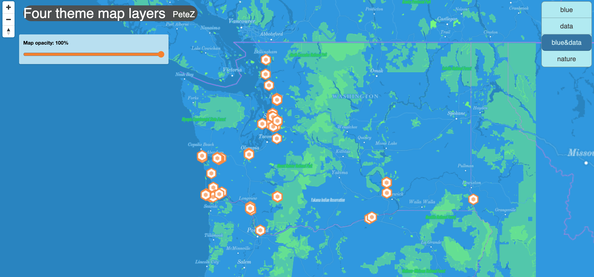

# *Four Themed Maps*
                - Peter Haoyang Zhou
                
### Here are four themed maps added on a dark-themed basemap where we can switch the maps on and off individually by the menu switch on the top right corner. All maps starts with zoom level 6 but allows zoom level from 0 to 10!

## *Modified Basemap*
- Url: https://studio.mapbox.com/styles/picefel/cl2s8rfpi000315l05kdi5o1n
### This is a modified base-map of Washington State as well as its margins with land mostly based with dark blue, light blue representing airports, dark green representing greens, and red representing hospitals.

## *Data Map*
### This is a map that contains the location of New Zealand Snail in the state of Washington with a light blue basemap provided by mapbox!

### source: https://geo.wa.gov/datasets/WSDOT::wsdot-new-zealand-mud-snail-locations/explore

## *Modified Basemap&Data*
- Url: this is the same as *Modified Basemap*!
### This is the combined version of the two above!

## *Nature-themed Map*
- Url: https://studio.mapbox.com/styles/picefel/cl2ulk2am000116n4ggmt591s
### This is a cartogram nature-themed map in the state of Washington using generated picture from *Lago di Braies*. Here's a screenshot and the original picture!

